## OLX Web Portal
### using MERN stack

- Steps to run
* run npm install
* start mongodb by running ***mongod***
* open browser: ***http://localhost:3000/olx***

Made By:
- 111903106 Siya Dhokane
- 1119031099 Shreya Kolkur

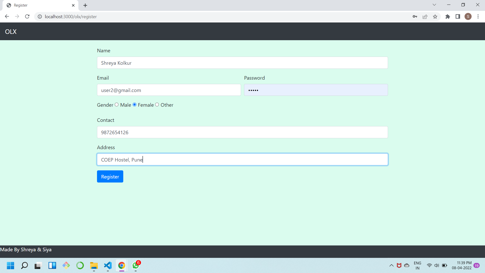
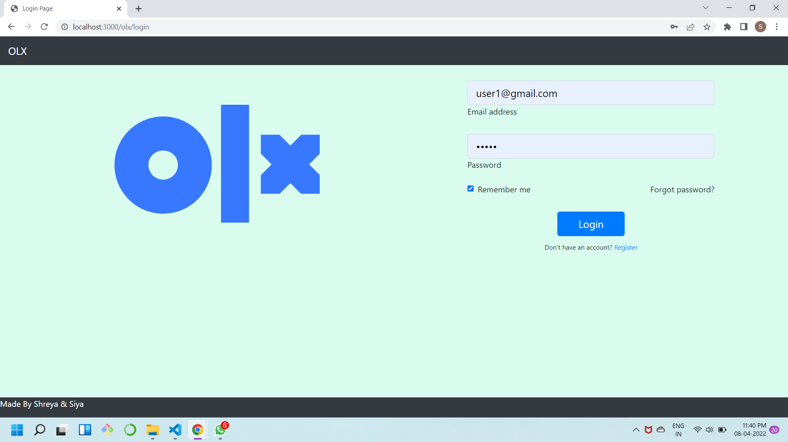
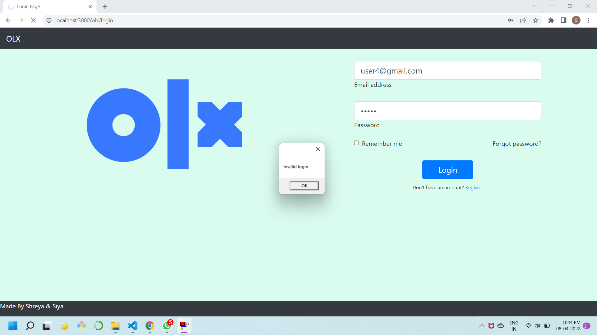
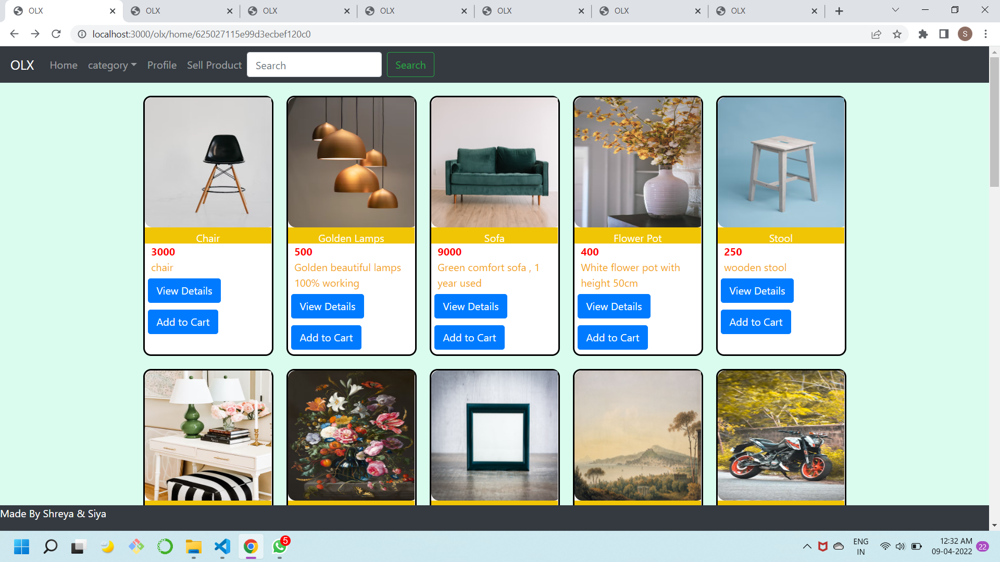
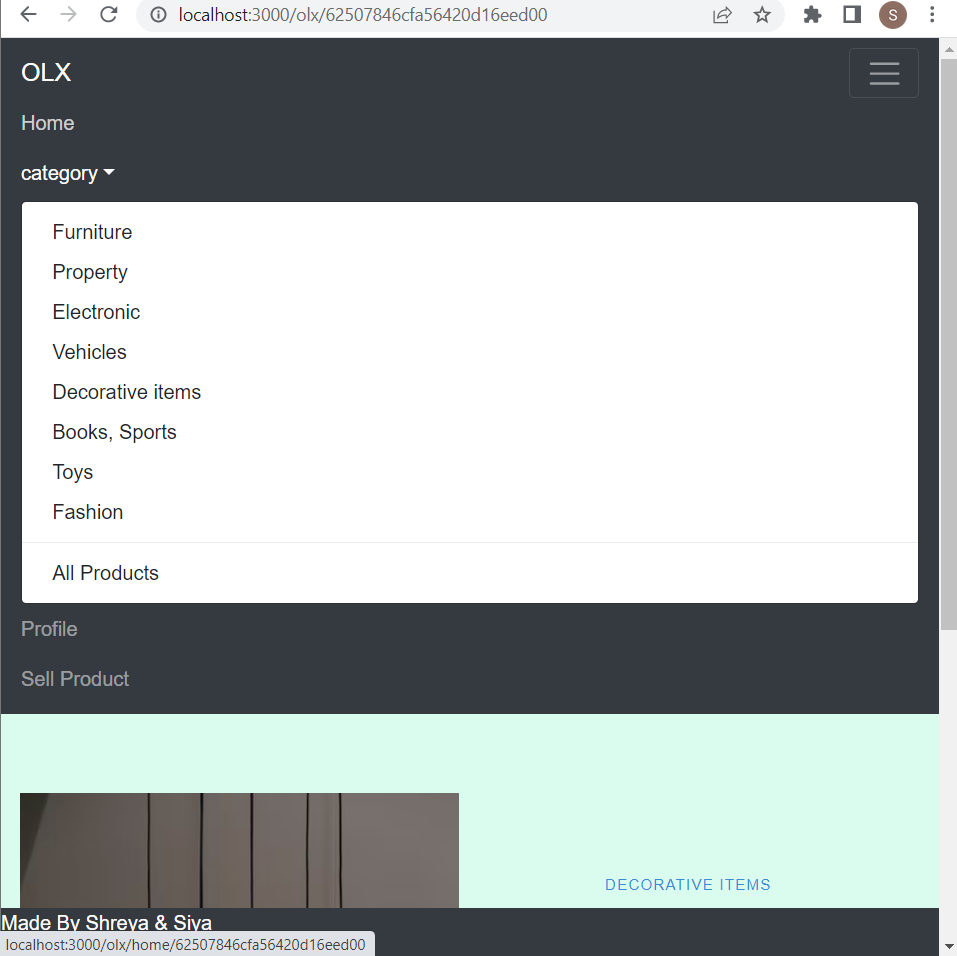
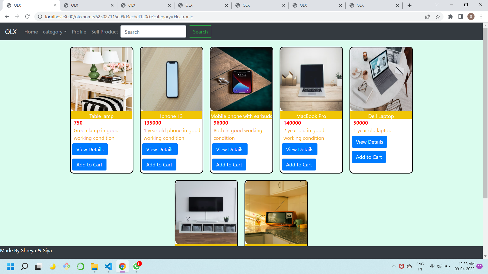
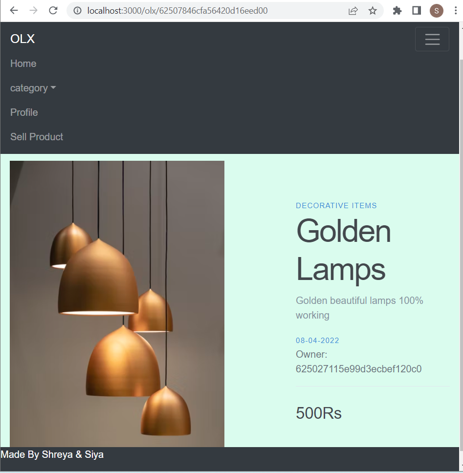
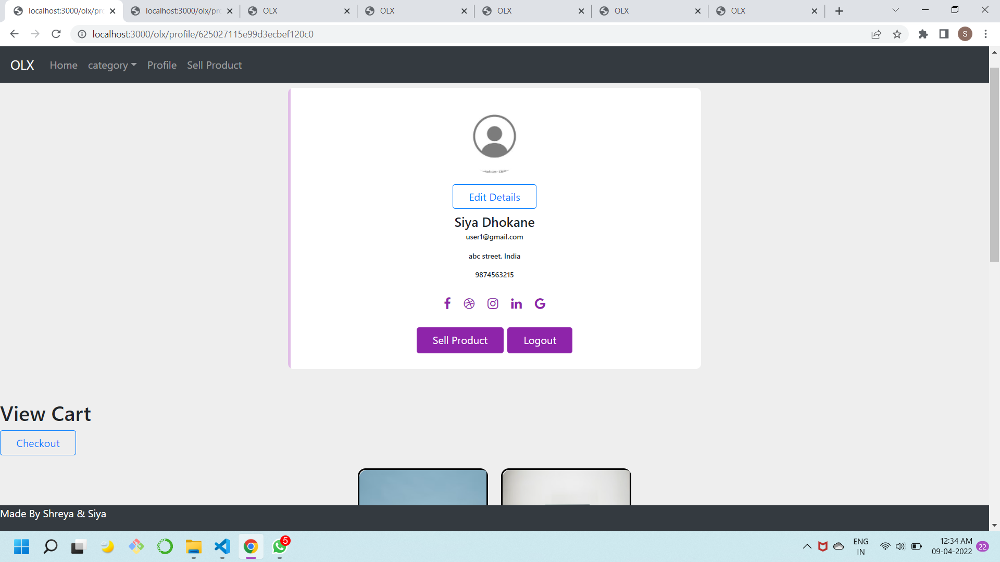
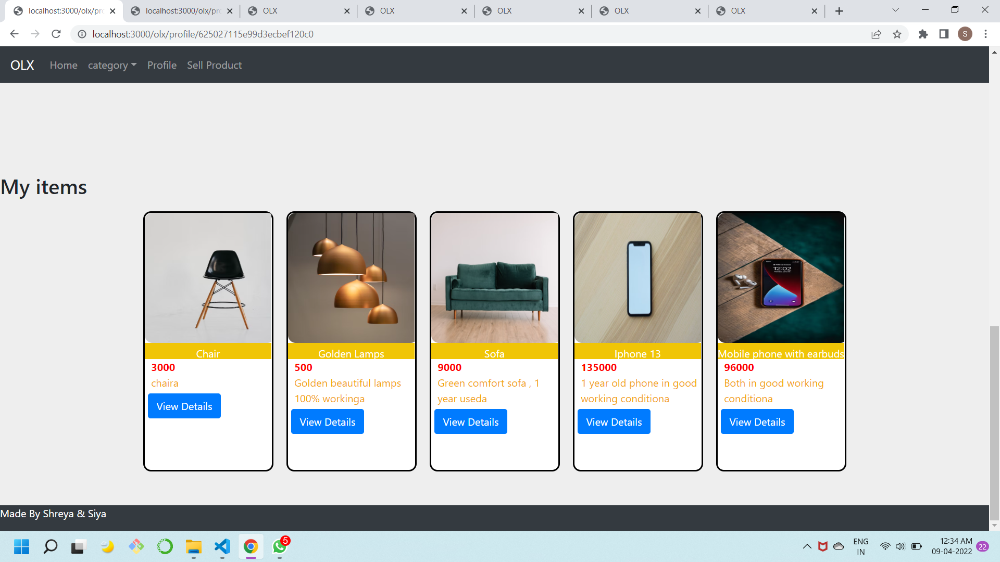
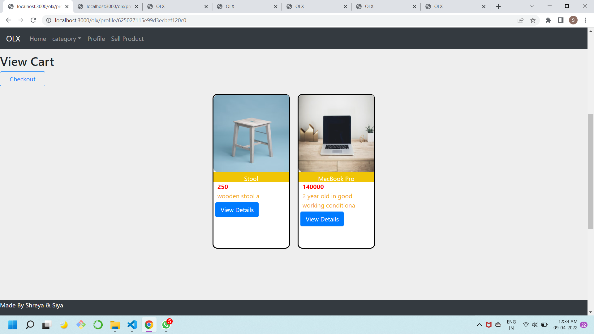

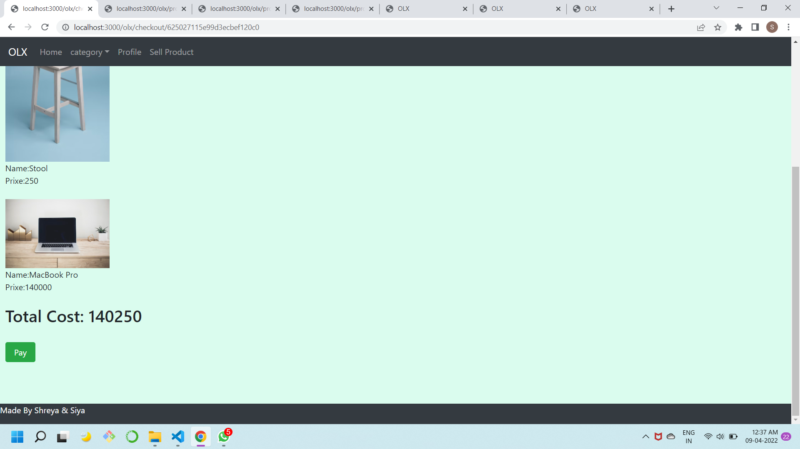

