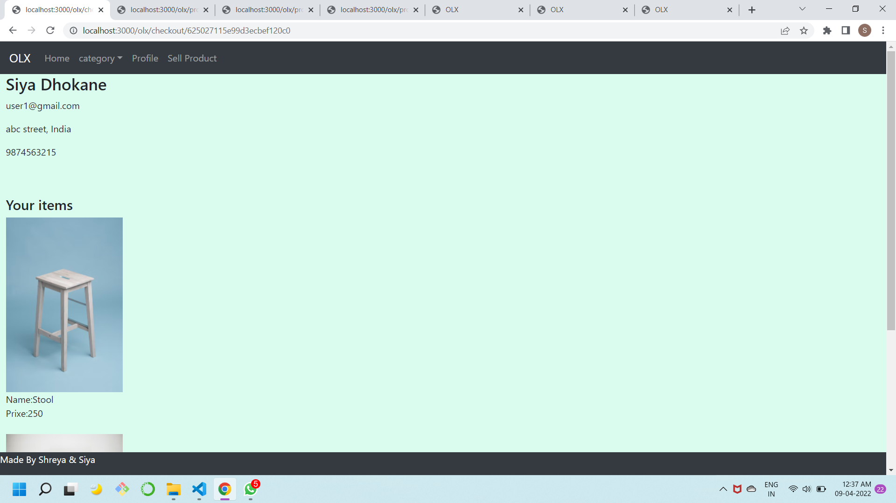

## OLX Web Portal
### using MERN stack

- Steps to run
* run npm install
* start mongodb by running ***mongod***
* run ***node index.js*** on cmd
* open browser: ***http://localhost:3000/olx***

Made By:
- 111903106 Siya Dhokane
- 1119031099 Shreya Kolkur

## Output Screenshot

### Register page for new user.

### Login page

### Invalid Login

### After logging in the user can view products and there is navigation using which user can view profile, sell product, filter by category

### Dropdown menu using which you can filter by category

### User filters product by category of electronics

### Complete details of the product

### Profile of the user.

### Cart of the user

### Items for sale by user

### Checkout Page

